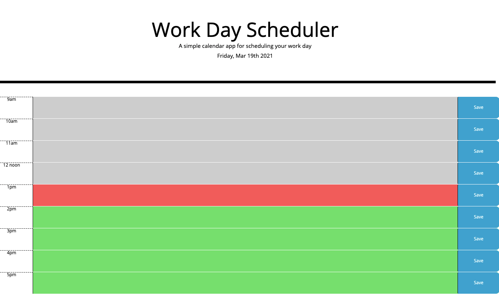

# My Daily Planner

This is a daily planner for planning your work day hour by hour.  It ranges from 9am to 5pm.  Each hour will appear color-coded to past, present, and future.  Once entered, the tasks entered in the planner are saved in local storage indefinitely.  

## Installation

https://artbat6.github.io/Work-Day-Scheduler/
To use this planner simply load it and begin entering tasks!

## Author
Arthur Bates

